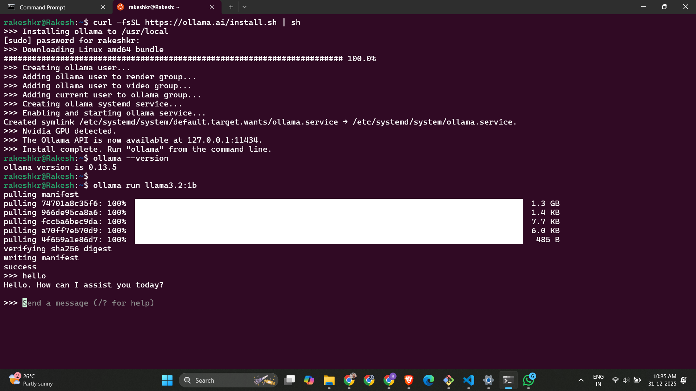

# document-qa-rag
This is a basic practice project for LLM-RAG system. 

## Directory Structure
```
document-qa-rag/
│
├── data/
│   ├── documents/          # Place your PDF files here
│   │   └── sample.pdf
│   └── vectorstore/        # ChromaDB will store embeddings here (auto-created)
│
├── src/
│   ├── __init__.py
│   ├── config.py           # Configuration settings
│   ├── document_loader.py  # PDF loading and chunking
│   ├── vectorstore.py      # Vector database setup
│   ├── retrieval_chain.py  # RAG chain construction
│   └── utils.py            # Helper functions
│
├── app.py                  # Main Gradio interface
├── ingest.py              # Script to process and index documents
├── requirements.txt        # Python dependencies
├── .env                    # Environment variables (optional)
└── README.md              # Project documentation
```



